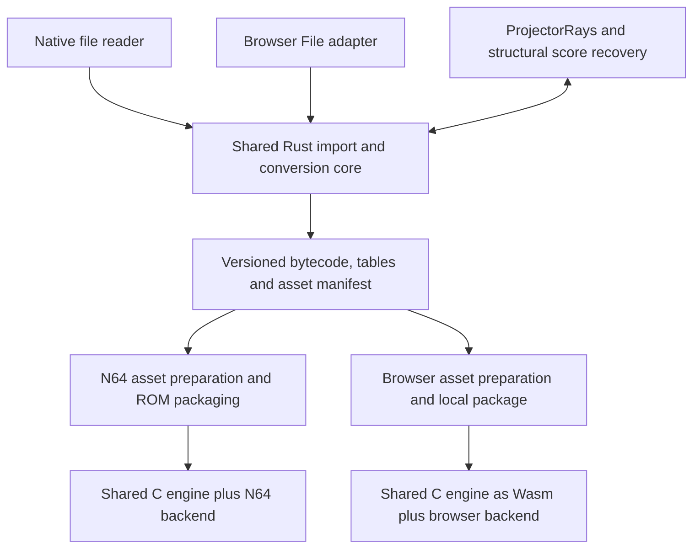

# Roadmap: browser player and local ISO import

Status, 2026-09-27: W1 to W4 are met for Workshop. W6 covers all six ports:
each imports from the user's own disc image in the browser and plays, with
loader, import and fuzzer parity against the native pipeline. Löwenzahn
brings video (WebCodecs) and printing (the browser's print dialog). W5
(Pages) is not started. Hosting target: GitHub Pages. Execution target:
desktop Chrome. See [web.md](web.md) for how to run it and the evidence
behind it. No Pages deployment exists yet. The current implementation is
described in [architecture.md](architecture.md); the shared converter work
remains in [roadmap.md](roadmap.md).

## Intended experience

Open the site, choose a local ISO, see the identified game and edition, prepare
it locally, and play with mouse, keyboard and sound. Show import progress and
allow cancellation. Subsequent sessions reuse a valid converted package when
available. Saves survive reloads and can be exported and imported separately.

The site serves the engine, conversion tools and supported-game profiles.
Original discs, recovered scripts and converted commercial assets stay local;
they are not uploaded to Pages or bundled into the public site. Import never
executes a disc's projector executable. An application update must not discard
player progress when it invalidates an asset cache.

Opening an ISO is distinct from supporting its game:

| Source | Player behavior |
| --- | --- |
| Known, qualified edition | Select its profile, prepare assets and offer normal play |
| Known edition with incomplete support | Show its specific limitations and qualification status |
| Unknown game with apparently supported requirements | Initially offer an inspection report; experimental execution is a later milestone |
| Unsupported format or required capability | Explain the blocker and identify the affected resource where possible |

General third-party compatibility is a separate effort. Successful recovery or
compilation is not evidence that a game is playable.

## Shared architecture

Keep `runtime/lingo/` and `runtime/director/` as the shared C implementation.
Compile them with Emscripten and add a `platforms/web/` backend. The native
probe remains the fast semantic comparison target; its image helpers are not
a complete renderer that can simply be recompiled for Canvas.

The existing bytecode has explicit operand byte order, but the compiler still
embeds it in generated C alongside tables containing pointers. Native probes
link those tables; N64 loads compiled overlays. Introduce a portable data
contract so a prebuilt Wasm runtime can load a newly converted game without
compiling C or loading MIPS overlays in the browser.

The package contract must specify:

- Format and bytecode ABI versions, Director profile, source hash, converter
  revision, game profile revision and required capabilities.
- Handler bytecode, constants, global and symbol tables, scores, casts, members,
  entry movie and asset references, including diagnostic source mappings.
- Explicit integer widths, byte order, section lengths and offsets/IDs rather
  than serialized C structs or process pointers. The loader validates bounds,
  references and budgets before constructing runtime structures.
- Scene working sets and asset variants with codec, dimensions and integrity
  metadata. Preserve authored coordinates and original-resolution inputs;
  N64 prescaling, palettes, compression and ROM budgets belong to its target
  preparation. Existing N64 assumptions embedded in shared helpers must move
  behind explicit target policy.
- Ownership and lifetime rules for resident casts, cross-movie references and
  unloaded scenes. Browser memory capacity must not hide invalid lifetimes.

Define this contract with both targets in mind. Keep generated C as a transition
path for N64 until the data loader has equivalent evidence; a browser milestone
must not silently change the console package or its performance gates.

## Host consolidation into Rust

Move reusable Python and Node conversion logic into shared Rust libraries,
used by the native CLI and browser workers. Migrate by pipeline stage and
compare outputs before replacing the old stage. Proposed modules can live in
a Cargo workspace alongside `compiler/`; exact crate boundaries are an
implementation decision.

| Responsibility | Direction |
| --- | --- |
| ISO indexing, bounded reads, source hashes and edition selection | Shared Rust importer |
| Source/resource models, manifest validation and conversion policy | Shared Rust data model |
| Lingo parsing and semantic conversion currently in Python | Move behind the compiler's Rust library interface in stages |
| Existing Rust AST-to-bytecode compiler | Separate library API from CLI/filesystem entry point; add binary package output |
| Node score/cast normalization and package generation | Shared Rust conversion stages |
| ProjectorRays parser/decompiler | Retain its existing Wasm dependency; exchange structured data through adapters |
| Separate structural score decoder | Provide a Wasm-callable entry point; preserve versioned recovery and provenance |
| Bitmap conversion implemented in project scripts | Move incrementally into Rust with pixel/output comparisons |
| Font and media subprocesses | Keep native paths initially; provide browser-capable implementations for each enabled game |
| Python build, capture, hardware and evidence orchestration | Retain as thin host tooling while it remains useful |
| Node filesystem, worker and subprocess wrappers | Replace with native and browser adapters |

ProjectorRays and Rust can initially be separate Wasm modules coordinated by a
small JavaScript worker. There is no requirement to rewrite every dependency
in Rust. The browser importer cannot rely on Node APIs, Python executables,
Docker, FFmpeg subprocesses or the host score-probe binary.

The ISO core operates over bounded offset/length reads, not host paths or a
whole-disc byte array. Make the asynchronous browser read boundary explicit;
the main thread must remain responsive. Transfer bounded buffers between
workers and Wasm and measure copies across module boundaries. Preserve the
current ISO validation, associated-stream handling, directory/expansion bounds
and exact edition hashes. Partial fingerprints may identify candidates, but
must not qualify an edition before full verification. ZIP and other disc
filesystems can follow the first ISO milestone.

## Browser backend and storage

- **Rendering:** begin with a software compositor in Wasm and framebuffer
  presentation to Canvas. Implement draw order, Director inks, masks, shapes,
  text, cursors and transitions explicitly. GPU acceleration follows measured
  need and must reproduce the same visual fixtures.
- **Clock and input:** use bounded engine updates, independent of display
  refresh. Map pointer coordinates through stage scaling and letterboxing;
  preserve press/drag/release ownership and clear held input on focus loss.
  Pause game time and audio together when the page is hidden or suspended;
  resume without replaying a large wall-clock backlog. Begin with mouse and
  keyboard; controller/touch support gets separate qualification.
- **Audio:** implement channel lifetime, gain, completion and playback position
  through Web Audio. Unlock audio on a user gesture before gameplay proceeds.
  Consider a mixer AudioWorklet when needed, with bounded message/buffer transfer
  and no mandatory shared-memory dependency. Video/codecs follow the games
  that require them; a browser's codec availability cannot be assumed to cover
  original QuickTime media.
- **Saves:** preserve each game's save codec and virtual file behavior. Bridge
  synchronous runtime reads/writes through a loaded in-memory save image and
  serialized durable snapshots. Report persistence failures; show a save as
  durable only after its flush succeeds. Flush during play, not only on page
  unload. Test abrupt reloads, failed writes and schema migration.
- **Cache:** store validated converted packages in OPFS, keyed by source hash,
  converter/profile revision, package ABI and asset policy. Commit imports
  atomically after validation; cancellation must leave no usable partial entry.
  Keep saves in a distinct namespace, independent of converter revision.

OPFS is origin-scoped and subject to quotas and eviction; site-data removal
deletes it. Handle unavailable storage and quota errors, allow cache removal
without deleting saves, and provide save export/import. Namespace storage by
application as well as game/source, since Pages project paths can share an
origin. A future origin/domain change needs an explicit save-transfer path.
See [OPFS documentation](https://developer.mozilla.org/en-US/docs/Web/API/File_System_API/Origin_private_file_system).

## GitHub Pages deployment

Pages serves a static application over HTTPS. All game import, conversion and
execution happens in the browser; there is no conversion server or upload API.
The deployed artifact contains only the application, runtime/tool Wasm modules,
profiles, notices and redistributable synthetic examples. See
[GitHub Pages](https://docs.github.com/en/pages/getting-started-with-github-pages/what-is-github-pages).

The baseline build must run without cross-origin isolation: use single-threaded
Wasm modules and ordinary workers with messages/transferable buffers. Do not
require pthreads, SharedArrayBuffer or an isolation-injecting service worker.
Emscripten pthreads require COOP/COEP deployment headers; optional threading
would therefore need a separately verified hosting design. See
[Emscripten pthreads](https://emscripten.org/docs/porting/pthreads.html).

Build for a configurable project base path such as `/director64/`; resolve
Wasm, worker, audio-worklet and other asset URLs beneath that base. Use a single
entry page with hash/query navigation so reloads need no server-side route
rewrites. Pin toolchains, use versioned assets, and publish a build manifest
identifying the runtime and converter. Optional offline application caching
comes later and must update modules coherently without deleting saves.

Once a GitHub publishing repository exists, use an Actions build on `main`
and the Pages configure/upload/deploy actions to publish only the generated
site directory. Use the `github-pages` environment and the required deployment
permissions. Public CI builds and tests synthetic fixtures; private game media
and local qualification artifacts never become Pages inputs. See
[custom Pages workflows](https://docs.github.com/en/pages/getting-started-with-github-pages/using-custom-workflows-with-github-pages).

The public repository is `github.com/elohmeier/director64`; the workflow in
`.github/workflows/pages.yml` builds and deploys the site from `main`. Qualify the actual
Pages URL as well as localhost: verify project-path asset loading, Wasm delivery,
workers, audio startup and persistence without custom server configuration.

## Compatibility and playability evidence

Build on [compatibility tracking](../games/findus-workshop/compatibility/README.md),
[native tests](../tests/native/README.md), [fuzzing](fuzzing.md) and
[original-projector captures](reference-capture.md). First reconcile the
conformance catalog with existing tests: its unpopulated implementation/evidence
fields are not a reliable measurement of the working engine's support.

Maintain a capability matrix by Director version and backend. Keep missing,
partial and implemented behavior separate from untested, passing and failing
evidence. Generate per-game requirements from recovered resources and resolved
AST/IR instead of relying solely on lexical call counts. Include dynamic calls,
unresolved resources, Xtras and unsupported codecs as explicit unknowns or gaps.

| Measurement | Required evidence |
| --- | --- |
| Import coverage | Resources recovered, unresolved records, rejected formats and exact source/profile identity |
| Semantic conformance | Small language cases and movie fixtures; expected results and versioned reference provenance |
| Execution coverage | Visited movies, executed handlers/branches, unsupported-operation records and recovered script alerts |
| Playability | Named journeys with input replay, state, visual/audio checkpoints, save/reload and failures |
| Performance | Cold import time, warm startup, peak memory, scene-entry stalls, tick delivery, frame time and audio underruns |

Use native/Wasm trace parity to gate compiler and backend changes. Corroborate
language and score behavior with the selected local media and the local ScummVM
checkout after recording its revision and worktree state. ScummVM agreement,
original-projector comparison, browser qualification and N64 hardware evidence
remain distinct. Build feature-level tests beyond current game journeys and
reserve third-party titles as an evaluation corpus to reveal missing general
behavior rather than fitting every metric to existing ports.

Every measured run records engine/converter revision, source identity, test
version, browser/OS/hardware, inputs and relevant clock/random seeds. Separate
import costs from runtime costs and fresh imports from cache hits. Set explicit
per-scenario budgets from the first baseline before qualifying a release;
unknown or unmeasured cases never count as passing. Report case counts and
blocking features, not a universal percentage of Director implemented.

## Milestones and gates

Status per milestone is below the table; W5 and W6 are planned. W0 can run alongside
the first backend work, and W3 can begin while W1/W2 are in progress.

| Milestone | Deliverable | Completion gate |
| --- | --- | --- |
| W0 Evidence baseline | Reconcile capability catalog; define Workshop browser journey, visual/audio cases and measurements | Existing tests mapped to claims; missing evidence distinguished from missing features; replay/reference identities pinned |
| W1 Playable Wasm backend | Shared C engine, Workshop adapter, generated tables linked into Wasm, locally prepared assets, Canvas/audio/input/save services | Boot to hub, complete Vemory, return to hub, save and reload; native state parity, visual/audio checkpoints, focus/pause and save-failure tests; baseline performance recorded |
| W2 Portable game package | Binary emitter/loader, validated sections, runtime/profile selection and browser asset variants | Same Workshop journey from a package without rebuilding Wasm; malformed/incompatible packages rejected; loader parity; console gates preserved for any shared changes |
| W3 Shared Rust importer | Native file and browser read adapters; ISO/source verification and staged Python/Node migration | Byte-identical inventories/extracted resources against the old importer; malformed-input tests; normalized IR/package/decoded-asset parity; bounded memory on real discs |
| W4 Local ISO to play | Browser recovery, Lingo parsing/compiler, Workshop asset conversion, progress/cancel and persistent package cache | Fresh browser profile selects the supported ISO and completes W1 without host tools; warm reopen works; cancellation/quota/update/save-export paths pass; no source data uploaded |
| W5 Pages release | Static reproducible artifact, publishing repository/workflow and deployed-site checks | Source-free public build; actual Pages project URL passes W4; asset paths, worker/Wasm loading, audio and saves work without isolation headers; measured budgets pass |
| W6 Broader playability | Additional supported editions/profiles, required media/font services and third-party inspection | Each title has its own requirements report and named passing journeys; unknown-game execution remains experimental until qualified |

W1 status (2026-09-27, [web.md](web.md)): the shared engine and the Workshop
adapter run as Wasm with a software compositor, Web Audio, mouse input and
OPFS saves. Native state parity passes on fuzzer episodes and every START
journey. The Vemory journey, save and page reload pass in headless Chromium,
as does the focus/pause check. Save-failure paths have contract tests, and
the baseline performance is recorded. Still open: visual and audio checkpoints
against a reference, plus peak memory and scene-entry measurements.

W2 status (2026-09-27): Workshop plays from a versioned package
([package-format.md](package-format.md)) in a runtime that links no game data.
Loader parity is field-for-field against the generated C. Malformed and
incompatible packages are rejected. Every START journey and the fuzzer
episodes still match the native probe. The console keeps its generated C.

W3 status (2026-09-27): the ISO reader, the Lingo parser and every recovery
and conversion stage after the ProjectorRays parse are ported to Rust. Each
has byte-level parity with the stage it replaced on all six local corpora.
The native pipeline and the browser importer run the same Rust stages. On the
host they are `director64-aot director`; in the browser they are the
converter's WebAssembly module over the in-memory file system. ProjectorRays
parses each file once into a dump those stages read. Driven from the ISO, the
importer reproduces the native pipeline's program, model, package and assets
byte for byte. Embedded PFR1 fonts recover with the converter's own decoder
and OpenType writer, byte-identical to the fonts the pinned host extractor
produced. Still open: video/Flash post-processing runs only on the host,
and only Workshop has a browser profile; memory is bounded by
holding the extracted disc and the parser's dumps in memory, not by
streaming.

W4 status (2026-09-27): in Chrome, a fresh profile imports Workshop's ISO in
9 s without host tools, completes the Vemory journey with a save and a
reload, reopens warm from the cache, and handles cancellation, wrong discs
and converter updates, all without uploading anything. Quota exhaustion and
save export are unit-tested rather than exercised in a browser.

W1 is a local development milestone: its statically linked recovered game data
does not belong in the public Pages artifact. W2 and W4 remove that dependency
before the public player release. Runtime versions and compiled game adapters
can initially be separate downloadable Wasm builds selected by profile; a
single runtime supporting every Director family is not required for W5.

After Workshop, use the existing ports to widen coverage deliberately: extended
D6 services, D7/D8 behavior and fonts, then D5 video and D10 window/Flash-related
requirements as their missing capabilities land. Prefer declarative profiles
for entry selection, virtual directories, save policy and documented exceptions.
General Director behavior belongs in the shared engine. Browser execution of
an arbitrary third-party disc remains a measured compatibility outcome, not an
automatic consequence of accepting its ISO.
